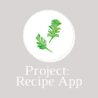

<body>
Hello, I'm Jenna! I recently graduated from Codaisseur Academy in Amsterdam as a Full Stack Developer. 

Take a look at my projects if you would like to see what I've worked on ↖  I'm particularly interested in frontend development and I'm continuing to build on my coding skills through new projects ✨
 </body>

<!--
**JennaLeysens/JennaLeysens** is a ✨ _special_ ✨ repository because its `README.md` (this file) appears on your GitHub profile.

Here are some ideas to get you started:

- 🔭 I’m currently working on ...
- 🌱 I’m currently learning ...
- 👯 I’m looking to collaborate on ...
- 🤔 I’m looking for help with ...
- 💬 Ask me about ...
- 📫 How to reach me: ...
- 😄 Pronouns: ...
- ⚡ Fun fact: ...
  -->
